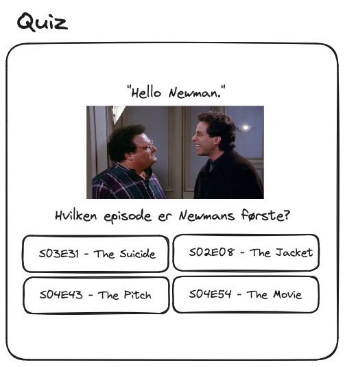
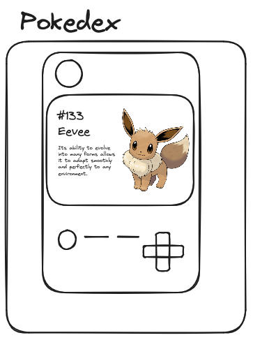
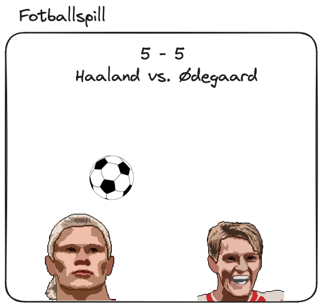
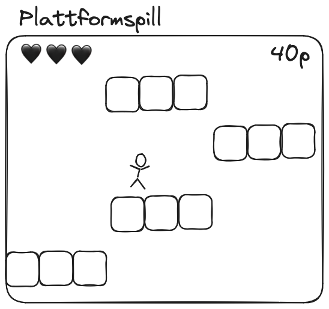

import { Callout } from 'nextra/components'

# Vårprosjekt

Her kommer idéer og tips til prosjekter som kan lages for å vise kompetanse i mappevurderingen.

## Idé 1 - Quiz

En quiz i Pygame som henter spørsmål fra et datasett.

<Callout>
    Datasett finner du på [kaggle.com/datasets](https://www.kaggle.com/datasets).
    Her er noen eksempler:

    - [Seinfeld, manus og info om episoder](https://www.kaggle.com/datasets/thec03u5/seinfeld-chronicles )
    - [Friends-episoder](https://www.kaggle.com/datasets/rezaghari/friends-series-dataset)
    - [Friends-manus](https://www.kaggle.com/datasets/divyansh22/friends-tv-show-script )
    - [Geoguessr-bilder](https://www.kaggle.com/datasets/ubitquitin/geolocation-geoguessr-images-50k)
</Callout>

## Idé 2 - Pokedex

En applikasjon laget i pygame som viser informasjon om pokemon.

<Callout>
    Du kan for eksempel bruke [JSON-filen vi brukte tidligere i år](https://it2.thorcc.no/apputvikling/oppgaver#32---lese-inn-data) eller [pokeapi.co](https://pokeapi.co/)
</Callout>

## Idé 3 - Fotballspill

Et fotballspill laget i pygame, der det er om å gjøre å holde ballen lengste i luften.

## Idé 4 - Plattformspill

Et plattformspill laget i pygame.

<Callout>
    På [github.com/TheVGLC/TheVGLC](https://github.com/TheVGLC/TheVGLC) ligger det ute mange _levels_ fra diverse klassikere.
    Trykk på et spill og velg mappen `Processed`.
</Callout>

## Idé 4 - Sjakknøtter

Hvis du har lyst på en utfordring ligger det et stort datasett med sjakknøtter på kaggle: [lichess-chess-puzzle-dataset](https://www.kaggle.com/datasets/tianmin/lichess-chess-puzzle-dataset).
Her er det mange muligheter!
