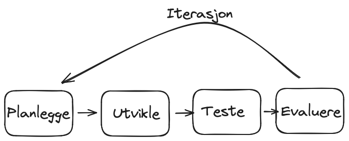

import { Callout } from 'nextra/components'

# Vårprosjekt

Her kommer idéer og tips til prosjekter som kan lages for å vise kompetanse i mappevurderingen.

## Smidig utvikling

Smidig utvikling er en måte å utvikle produkter på, hvor man jobber i korte perioder, eller _runder_, for å lage små deler av produktet om gangen.
Eter hver runde testes og evalueres produktet og det legges en plan for neste runde.
Dette gjør det enklere å endre på prosjektet underveis, derav navnet _smidig_.

Man starter gjerne med å lage det man kaller for et _Minimum Viable Product_ (MVP), som er det enkleste produktet man kan lage for å kunne få tilbakemeldinger og evaluere produktet.

Hvis man for eksempel skal lage et transportmiddel som tar folk fra A til B, starter man med det enkleste produktet man klarer komme på som løser problemet.
Da kan det være man starter med en planke med fire hjul, så får man tilbakemeldinger, evaluerer, legger til litt og litt, kjører prosessen på nytt en del ganger og til slutt ender man opp med en bil.

## Anbefalt arbeidsmåte

1. Velg et tema eller en idé. 
    - Det trenger ikke være veldig gjennomtenkt, det viktigste er at du velger noe.
    - Hvis du er usikker, anbefaler jeg at du starter med å lage en Quiz.
2. Start enkelt - lag en [MVP (minimum viable product)](https://en.wikipedia.org/wiki/Minimum_viable_product)
    - Hvis du lager quiz, start med å lage en quiz som kun inneholder ett spørsmål
    - Tegn skisse før du starter å programmere -> [excalidraw.com/](https://excalidraw.com/) fungerer bra for å tegne enkle skisser
3. Evaluer underveis og sett nye mål
    - Se over det du har laget og finn ut hva du vil gjøre videre
    - En naturlig vei videre for en quiz er å legge til flere spørsmål
4. Jobb stykkevis og delt, ikke fullt og helt
    - Legg til én ting om gangen
    - I en quiz bør du for eksempel først legge til flere spørsmål før du legger til poeng

## Idéer

### Idé 1 - Quiz

En quiz i Pygame som henter spørsmål fra et datasett.

<Callout>
    Datasett finner du på [kaggle.com/datasets](https://www.kaggle.com/datasets).
    Her er noen eksempler:

    - [Seinfeld, manus og info om episoder](https://www.kaggle.com/datasets/thec03u5/seinfeld-chronicles )
    - [Friends-episoder](https://www.kaggle.com/datasets/rezaghari/friends-series-dataset)
    - [Friends-manus](https://www.kaggle.com/datasets/divyansh22/friends-tv-show-script )
    - [Geoguessr-bilder](https://www.kaggle.com/datasets/ubitquitin/geolocation-geoguessr-images-50k)
</Callout>

### Idé 2 - Pokedex

En applikasjon laget i pygame som viser informasjon om pokemon.

<Callout>
    Du kan for eksempel bruke [JSON-filen vi brukte tidligere i år](https://it2.thorcc.no/apputvikling/oppgaver#32---lese-inn-data) eller [pokeapi.co](https://pokeapi.co/)
</Callout>

### Idé 3 - Fotballspill

Et fotballspill laget i pygame, der det er om å gjøre å holde ballen lengste i luften.

### Idé 4 - Plattformspill

Et plattformspill laget i pygame.

<Callout>
    På [github.com/TheVGLC/TheVGLC](https://github.com/TheVGLC/TheVGLC) ligger det ute mange _levels_ fra diverse klassikere.
    Trykk på et spill og velg mappen `Processed`.
</Callout>

### Idé 5 - Sjakknøtter

Hvis du har lyst på en utfordring ligger det et stort datasett med sjakknøtter på kaggle: [lichess-chess-puzzle-dataset](https://www.kaggle.com/datasets/tianmin/lichess-chess-puzzle-dataset).
Her er det mange muligheter!
